**Part 1** <br>
Bug: in reverseInPlace method- the spots must be swapped but the values are overriden <br>
*A failure-inducing input for the buggy program, as a JUnit test and any associated code* <br>
  ```
  @Test 
  public void testArrayExamplesOG(){ 
    //bugs in reverse in place method 
    int[] arr1 = {1,2,3};
    ArrayExamples.reverseInPlaceOG(arr1); 
    int[] exparr1 = {3,2,1}; 
    assertArrayEquals(exparr1, arr1); 
  } 
  ```

*An input that doesn’t induce a failure, as a JUnit test and any associated code <br>*
```	
 @Test <br>
public void testReverseInPlace() { 
    int[] input1 = { 3 }; 
    ArrayExamples.reverseInPlace(input1); 
    assertArrayEquals(new int[]{ 3 }, input1);
}
```

*The symptom, as the output of running the tests (provide it as a screenshot of running JUnit with at least the two inputs above)*
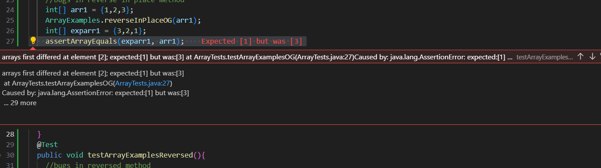<br>
output of the non failure inducing input test 
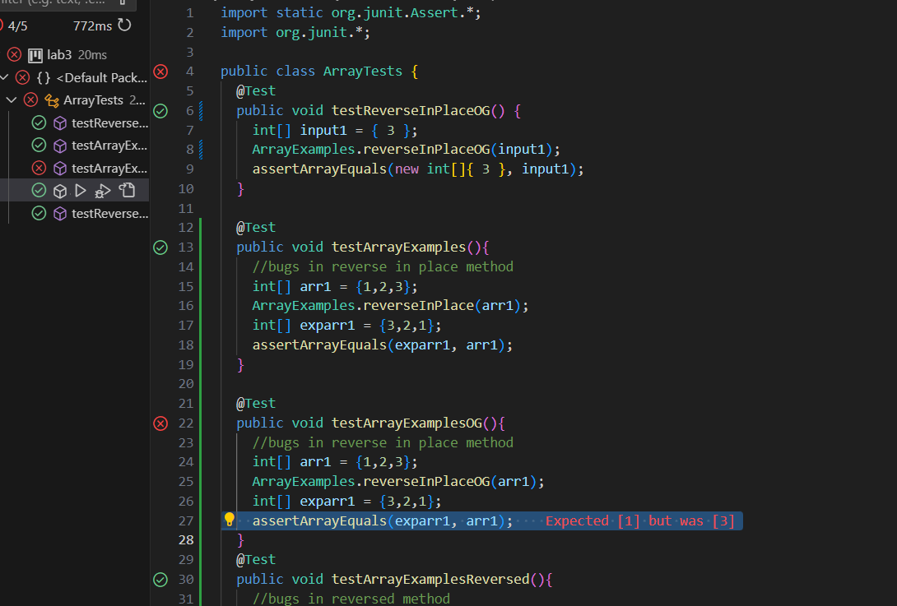<br>


*The bug, as the before-and-after code change required to fix it (as two code blocks in Markdown)*
  original code <br>
  static void reverseInPlaceOG(int[] arr) { <br>
    for(int i = 0; i < arr.length; i += 1) { <br>
      arr[i] = arr[arr.length - i - 1]; <br>
    } <br>
  }<br>

*after code*
  static void reverseInPlace(int[] arr) <br>
    int temp = 0; <br>
    for(int i = 0; i < arr.length/2; i += 1) { <br>
      temp = arr[i]; <br>
      arr[i] = arr[arr.length - i - 1]; <br>
      arr[arr.length-i-1] = temp; <br>
    } <br>
  } <br>
The fix addresses the bug because a temporary variable is used to store a given value, therefore the value will not be lost. Also, since the fist half/second half are being swapped the loop only iterates to the arr.length/2

  **Part 2**
  *4 implementations of grep with two examples for each implementation* <br>
  1.   -v to display the non matching lines. It outputs all the lines that don't contain the word.<br>
```
grep -v biomed technical/biomed/1468-6708-3-1.txt
```
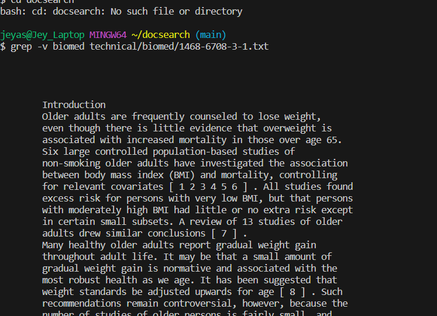<br>
```
grep -v morning technical/911report/chapter-1.txt
``` 
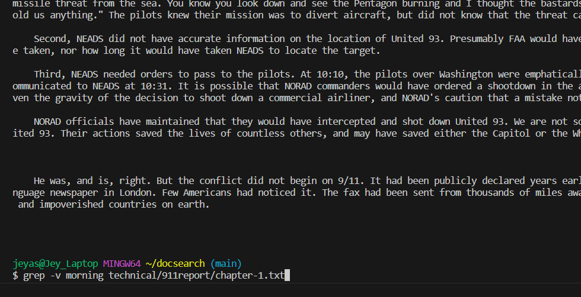<br>
output is shown below, but I am unable to scroll up to the command. <br>
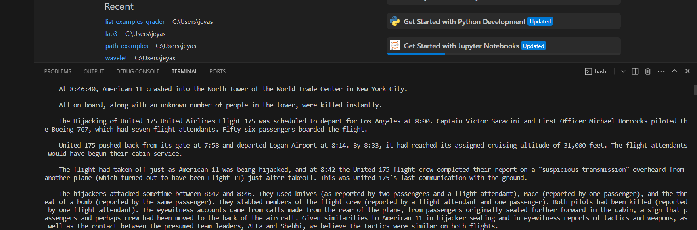<br>
  3. -q to cause the grep to go silent (not release an output). The command only has an output after the echo $? command. It prints 0 if the string was found and it prints 1 if it was not found.<br>
```
grep -q between technical/plos/journal.pbio.0020001.txt
``` 
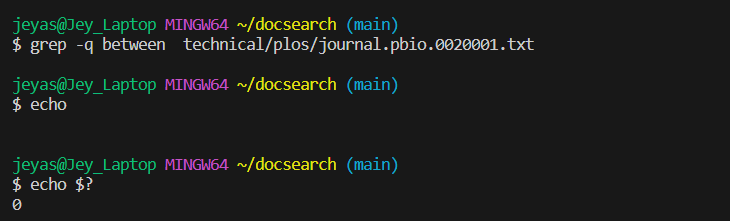<br>
```
grep -q biology technical/biomed/1471-213X-1-4.txt
``` 
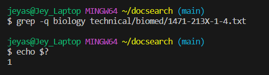<br>
  4. -r recursive searches through nested directories. It searches through the nested directories (from the working directory) to find the desired word. <br>
```
grep -r -i dead
``` 
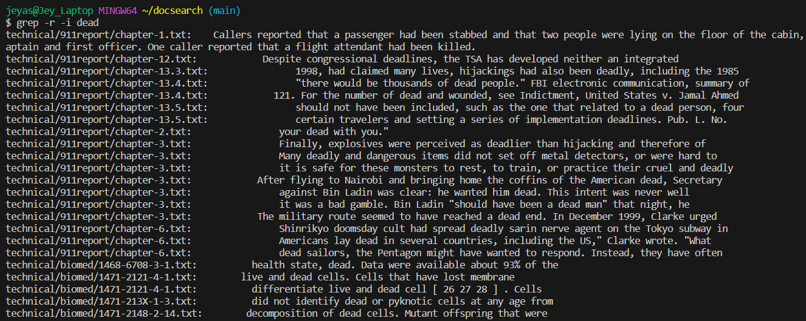<br>
```
grep -r -i beauty
``` 
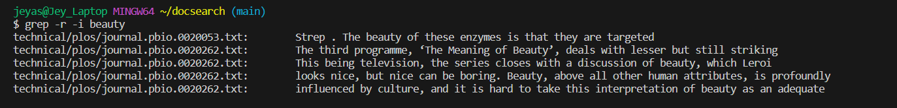<br>
  5. -i ignores case. If the command is not case sensitive and just outputs all lines containing the word regardless of case<br>
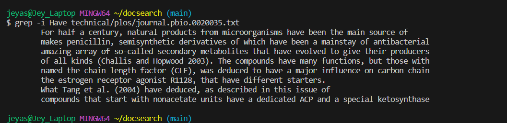<br>
```
grep -i Have technical/plos/journal.pbio.0020035.txt
```
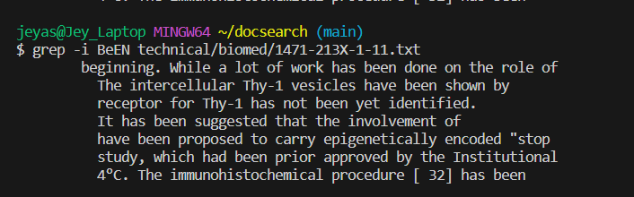<br>
```
grep -i BeEN technical/biomed/1471-213X-1-11.txt
``` 
source: https://www.howtogeek.com/496056/how-to-use-the-grep-command-on-linux/ 
